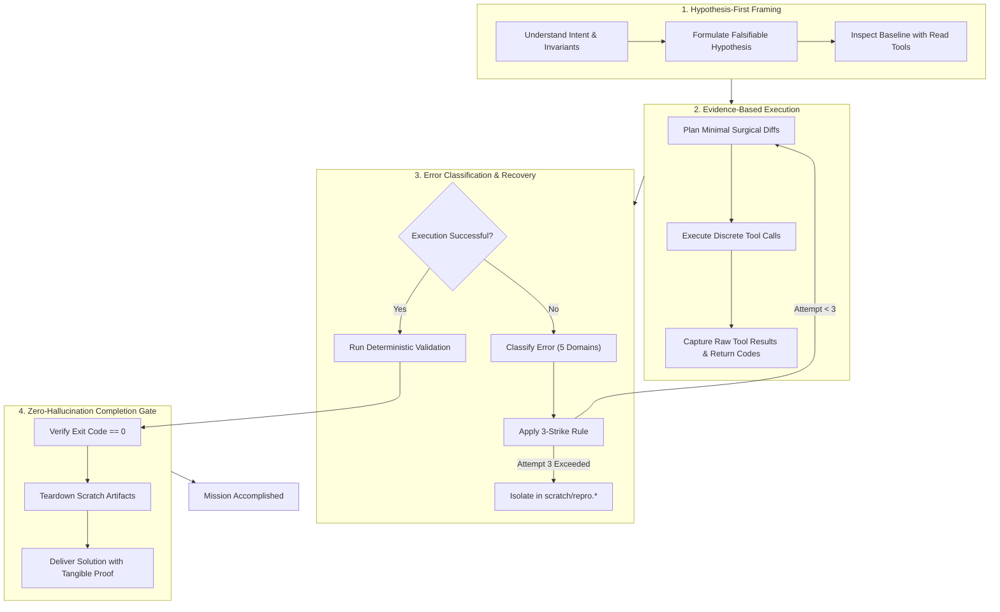

# GEMINI X HERMES 🧠⚡

<p align="center">
  
  
  
  
  
</p>

> **"Never guess when you can verify. Never claim completion without proof. Never repeat a failing path without changing the underlying state."**

---

## 🌟 Overview

**GEMINI X HERMES** unites the multimodal power, high-throughput semantic reasoning, and vast context window of **Google Gemini** with the autonomous cognitive discipline, self-correction loops, and multi-agent synthesis of **Hermes Agent** ([NousResearch](https://github.com/NousResearch)).

Packaged as a universal **Global Skill** for **Google Antigravity**, this system transforms AI pair programming from passive code completion into an autonomous, rigorous, self-correcting engineering intelligence.

---

## 🚀 Fast Install

### Windows (PowerShell)
To install `hermes-cognition` globally into your Antigravity environment (`~/.gemini/config/skills/`):

```powershell
# Run from repository root:
.\scripts\install.ps1
```

Or for a specific local project:
```powershell
.\scripts\install.ps1 -Global:$false -ProjectPath "C:\path\to\your\project"
```

### Linux / macOS / WSL (Bash)
```bash
# Global installation:
./scripts/install.sh --global

# Project-specific installation:
./scripts/install.sh --local /path/to/project
```

Once installed, Antigravity automatically indexes the skill and activates it whenever you encounter complex debugging, architectural dilemmas, or multi-agent tasks.

---

## 🏗️ The 3-Tier Cognitive Architecture

```
+=============================================================================+
|                      TIER 1: STABLE COGNITIVE PROTOCOL                      |
|  - Falsifiable Hypothesis-First Problem Framing                             |
|  - Minimal Surface-Area Code Modifications (AST preservation)               |
|  - 3-Strike Anti-Loop Guardrail (stops circular debugging retries)          |
+=============================================================================+
                                       |
                                       v
+=============================================================================+
|               TIER 2: MIXTURE-OF-AGENTS (MoA) & SUBAGENT SYNTHESIS          |
|  - Parallel dispatch: Security Auditor, Code Reviewer, Test Engineer        |
|  - Multi-perspective consensus modeling & conflict resolution               |
|  - Aggregator pattern: consolidates reviews into one unified delivery       |
+=============================================================================+
                                       |
                                       v
+=============================================================================+
|                 TIER 3: CONTEXT COMPACTION & WORKING MEMORY                 |
|  - Sliced tool execution (StartLine/EndLine) prevents context bloat         |
|  - State journaling: Persistent memory in .agents/CONTEXT.md                |
|  - Zero-Hallucination Gate: Empirical test proof before completion claims  |
+=============================================================================+
```

---

## 🔁 The 4-Stage Hermes Execution Loop



---

## 🛡️ Core Protocols & Decision Matrices

### 1. Error Taxonomy & Anti-Loop Guardrail
Never let an agent retry blindly. Hermes classifies all errors into 5 actionable domains:
1. **Syntax / Parse**: Malformed AST, unclosed brackets, regex escaping.
2. **Import / Dependency**: Missing modules, wrong virtualenv interpreter.
3. **Runtime / State**: Null references, uninitialized variables, race conditions.
4. **Logic / Assertion**: Off-by-one errors, inverted conditionals, edge-case failure.
5. **Environment / I/O**: File locks, port collisions, permissions, network timeouts.

👉 **Deep Dive**: [docs/ERROR_CLASSIFICATION.md](docs/ERROR_CLASSIFICATION.md)

### 2. Mixture-of-Agents (MoA) Orchestration
For high-stakes tasks, the coordinator agent concurrently dispatches specialized subagents:
- **`security-auditor`**: OWASP vulnerabilities, secret leaks, input validation.
- **`code-reviewer`**: Separation of concerns, cyclomatic complexity, API boundaries.
- **`test-engineer`**: Edge cases, failure resilience, deterministic mocks.
- **`web-performance-auditor`**: Core Web Vitals, N+1 query patterns, memory leaks.

👉 **Deep Dive**: [docs/MIXTURE_OF_AGENTS.md](docs/MIXTURE_OF_AGENTS.md)

### 3. Context Compaction & Working Memory Hygiene
Long sessions cause context drift. Hermes preserves focus through:
- **Targeted Line Slicing**: Reads only the exact lines of interest using `StartLine`/`EndLine`.
- **Source Filtering**: Limits CLI outputs (e.g. `git log -n 5`, filtered searches).
- **Persistent Project Memory**: Stores enduring decisions in `.agents/CONTEXT.md`.

👉 **Deep Dive**: [docs/CONTEXT_HYGIENE.md](docs/CONTEXT_HYGIENE.md)

### 4. Zero-Hallucination Completion Gate
An agent is forbidden from saying *"This should work"* or claiming victory without concrete proof:
- Exit code must be `0`.
- Passing test outputs must be presented.
- Temporary scratch artifacts must be cleaned up.

👉 **Deep Dive**: [docs/VERIFICATION_CONTRACT.md](docs/VERIFICATION_CONTRACT.md)

---

## 📂 Repository Structure

```
GEMINI-X-HERMES/
├── .agents/
│   └── CONTEXT.md                    # Project architectural journal & memory
├── .github/
│   └── workflows/
│       └── validate.yml              # CI automated validation
├── docs/
│   ├── ARCHITECTURE.md               # Detailed cognitive engine architecture
│   ├── GLOBAL_SKILL_SYSTEM.md        # Antigravity global & local skill systems
│   ├── ERROR_CLASSIFICATION.md       # Error taxonomy & 3-strike rule
│   ├── MIXTURE_OF_AGENTS.md          # Multi-agent coordination & synthesis
│   ├── CONTEXT_HYGIENE.md            # Working memory retention & compaction
│   └── VERIFICATION_CONTRACT.md      # Zero-hallucination completion contract
├── examples/
│   ├── complex_bugfix_workflow.md    # Real-world walkthrough: complex bug resolution
│   └── multi_agent_audit_example.md  # Real-world walkthrough: multi-agent audit
├── memory-bank/                      # 🧠 v2: Error Memory Database
│   ├── bank.py                       # CRUD operations for error-solution pairs
│   ├── matcher.py                    # Fuzzy matching engine (difflib)
│   └── errors.json                   # Persistent error-solution database
├── self-grade/                       # 📊 v2: Self-Grading System
│   ├── grader.py                     # 5-dimension scoring engine (0-100)
│   ├── report.py                     # Markdown trend & summary reports
│   └── grades.json                   # Grade history database
├── skill-forge/                      # 🔨 v2: Auto Skill Generator
│   ├── forge.py                      # Workflow → SKILL.md generator
│   ├── templates/                    # Category templates (debugging, setup, workflow)
│   ├── forged-skills/                # Output: auto-generated skills
│   └── forge-log.json                # Forge history log
├── telemetry/                        # 📈 v2: Cognitive Telemetry Dashboard
│   ├── collector.py                  # Metrics collection engine
│   ├── dashboard_api.py              # Flask Blueprint API (port 19001)
│   └── metrics.json                  # Persistent metrics storage
├── scripts/
│   ├── install.ps1                   # Windows automated installer
│   └── install.sh                    # Linux / macOS automated installer
├── skills/
│   └── hermes-cognition/             # Ready-to-use skill package
│       ├── SKILL.md                  # Main skill specification & YAML frontmatter
│       └── references/
│           ├── error-classification.md
│           ├── memory-and-state.md
│           └── mixture-of-agents.md
├── AGENTS.md                         # Universal directives for AI coding agents
├── GEMINI.md                         # Gemini / Antigravity workspace instructions
├── CONTRIBUTING.md                   # Community contribution guidelines
├── LICENSE                           # MIT License
└── README.md                         # Project documentation
```

---

## 📚 Complete Documentation Index

| Guide | Description |
| :--- | :--- |
| 📖 [Global Skill System Guide](docs/GLOBAL_SKILL_SYSTEM.md) | How Antigravity mounts, prioritizes, and activates skills |
| 🏛️ [Cognitive Architecture](docs/ARCHITECTURE.md) | The deep mechanics of combining Gemini with Hermes |
| 🛑 [Error Classification Protocol](docs/ERROR_CLASSIFICATION.md) | The 5 error domains and 3-strike anti-loop rules |
| 🤖 [Mixture-of-Agents Protocol](docs/MIXTURE_OF_AGENTS.md) | Subagent orchestration and aggregator synthesis |
| 🧹 [Context Compaction Protocol](docs/CONTEXT_HYGIENE.md) | Keeping LLM context razor-sharp over long sessions |
| 🎯 [Zero-Hallucination Contract](docs/VERIFICATION_CONTRACT.md) | Strict proof and verification requirements |
| 💡 [Bugfix Example](examples/complex_bugfix_workflow.md) | Step-by-step example of resolving a distributed lock bug |
| 🔍 [Multi-Agent Audit Example](examples/multi_agent_audit_example.md) | Step-by-step example of pre-merge security & architecture audits |
| 🧠 [Error Memory Bank](memory-bank/) | **v2**: Persistent error-solution database with fuzzy matching |
| 📊 [Self-Grading System](self-grade/) | **v2**: 5-dimension auto-scoring engine (0-100, A+ through F) |
| 🔨 [Auto Skill Forge](skill-forge/) | **v2**: Workflow → reusable skill auto-generator |
| 📈 [Cognitive Telemetry](telemetry/) | **v2**: Real-time metrics dashboard & Flask API |

---

## 📄 License

This project is licensed under the [MIT License](LICENSE) © 2026 **purnomo yusgiantoro**.
