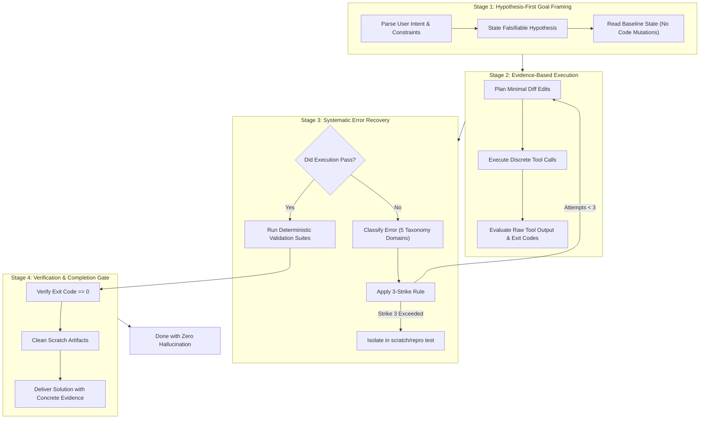

# Gemini x Hermes Cognitive Architecture

## 1. Philosophy: Blending Frontier Multimodal Reasoning with Autonomous Cognition

Modern Large Language Models (LLMs) often suffer from common agentic pitfalls:
1. **Circular Trial-and-Error**: Repeating the same failing command repeatedly while hoping for a different outcome.
2. **Premature Completion Claims**: Asserting "Done!" or "Fixed!" without running tests or verifying exit codes.
3. **Context Window Degradation**: Flooding working memory with massive dumps of terminal stdout, causing drift and hallucination.
4. **Single-Pass Tunnel Vision**: Lacking multi-angle audits on complex architectural decisions.

**GEMINI X HERMES** bridges **Google Gemini's** deep semantic reasoning and multimodal precision with the battle-tested autonomous cognition patterns of **Hermes Agent** (NousResearch).

```
+=============================================================================+
|                          GEMINI X HERMES ENGINE                             |
+=============================================================================+
                                      |
         +----------------------------+----------------------------+
         |                                                         |
         v                                                         v
+-------------------------------+         +-----------------------------------+
|     GOOGLE GEMINI (BRAIN)     |         |     HERMES COGNITION (DISCIPLINE) |
| - High-throughput reasoning   |         | - 3-Tier Architecture             |
| - Multimodal comprehension    | <=====> | - 4-Stage Execution Loop          |
| - Complex API synthesis       |         | - 3-Strike Anti-Loop Guardrail    |
| - Native tool calling         |         | - Mixture-of-Agents (MoA)         |
+-------------------------------+         +-----------------------------------+
                                      |
                                      v
+=============================================================================+
|                      RIGOROUS, VERIFIED DELIVERABLES                        |
+=============================================================================+
```

---

## 2. The Three-Tier Cognitive Architecture

```
+-----------------------------------------------------------------------------+
| TIER 1: STABLE COGNITIVE PROTOCOL                                           |
| - Hypothesis-first analysis: never edit without an explicit mental model     |
| - Minimal surface-area modifications (targeted AST diffs)                   |
| - 3-Strike Anti-Loop Guardrail: forbids circular debugging retries          |
+-----------------------------------------------------------------------------+
                                      |
                                      v
+-----------------------------------------------------------------------------+
| TIER 2: MIXTURE-OF-AGENTS & SUBAGENT SYNTHESIS                              |
| - Specialized subagent orchestration (Security, Performance, Code Review)   |
| - Parallel multi-perspective evaluation                                     |
| - Aggregator pattern: resolves trade-offs into unified implementation       |
+-----------------------------------------------------------------------------+
                                      |
                                      v
+-----------------------------------------------------------------------------+
| TIER 3: CONTEXT COMPACTION & PROJECT MEMORY                                 |
| - Lean tool execution: strict line-range slicing (StartLine/EndLine)        |
| - Project memory journal: persistent context in .agents/CONTEXT.md          |
| - Zero-Hallucination Gate: empirical verification before declaring victory  |
+-----------------------------------------------------------------------------+
```

---

## 3. The 4-Stage Hermes Execution Loop

Every non-trivial engineering task follows four sequential phases:



### Stage 1: Hypothesis-First Goal Framing
Before modifying a single line of code, the agent answers:
1. *What is the root cause of the current state?*
2. *What exact behavior is expected once modified?*
3. *How will the change be falsifiably proven right or wrong?*

### Stage 2: Minimal-Surface Area Execution
- Changes are surgical. Entire files are never rewritten if changing 5 lines suffices.
- Structural semantics, existing comments, and code conventions are preserved.

### Stage 3: Error Classification & 3-Strike Rule
When an error occurs, the agent does not immediately retry. It classifies the error into one of five domains:
1. **Syntax / Parse**
2. **Import / Dependency**
3. **Runtime / State**
4. **Logic / Assertion**
5. **Environment / I/O**

The **3-Strike Rule** strictly forbids running the exact same failing command more than once without altering the underlying code or environment state.

### Stage 4: Zero-Hallucination Gate
An agent operating under Gemini x Hermes is prohibited from writing phrases like *"This should now work!"* or *"I have fixed the issue"* unless accompanied by visible evidence: passing test outputs, zero exit codes, or deterministic validation logs.
