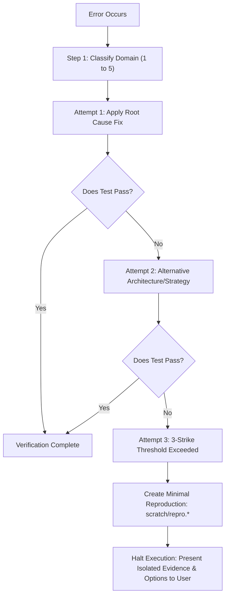

# Systematic Error Classification & Anti-Loop Protocol

When an automated agent encounters an unexpected error or failing test, naive agents often fall into a trap called **"The Circular Loop"**: repeatedly re-running the same failing command, toggling irrelevant code back and forth, or apologizing without addressing root cause.

The Hermes error protocol replaces guesswork with an exhaustive taxonomic decision tree.

---

## 1. The 5 Error Taxonomy Domains

| Domain | Characteristic Symptoms | Common Root Causes | Mandatory Remediation Protocol |
| :--- | :--- | :--- | :--- |
| **1. Syntax / Parse** | `SyntaxError`, `ParseError`, unexpected token, indentation mismatch, missing bracket | Malformed AST, unclosed strings, regex delimiter collision | 1. Identify exact line and column. 2. Read 10 lines of surrounding context. 3. Verify language grammar constraints before editing. |
| **2. Import / Dependency** | `ModuleNotFoundError`, `ImportError`, unresolved symbol, DLL load failed | Missing package, mismatch between global vs virtualenv interpreter, outdated lockfile | 1. Check active interpreter environment (`pip list`, `npm ls`). 2. **Never** edit application code if the dependency itself is missing. 3. Install or update required dependency. |
| **3. Runtime / State** | `NullPointerException`, `AttributeError`, `IndexError`, undefined property access | Uninitialized object, race condition, unexpected API payload structure | 1. Trace call stack backwards to the origin of `None`/`null`. 2. Add defensive guards and explicit type assertions. 3. Handle nullable states gracefully. |
| **4. Logic / Assertion** | Test failure, `AssertionError`, semantic mismatch, off-by-one result | Flawed algorithm, inverted boolean condition, unhandled boundary value | 1. Print and contrast expected vs actual value. 2. Map edge cases (empty list, 0, boundary values). 3. Update logic with targeted unit test. |
| **5. Environment / I/O** | `EACCES`, `AccessDenied`, connection refused, port already in use, timeout | Missing permissions, locked files, dead network endpoint, lingering daemon | 1. Check running processes and file locks. 2. Inspect port bindings and network listeners. 3. Never retry blindly without resolving the environmental lock. |

---

## 2. The 3-Strike Anti-Loop Guardrail

To prevent unbounded retries:

### The Invariance Principle
> **Rule**: An agent is strictly prohibited from running the identical command with identical parameters if no file, environment variable, or dependency has been changed since the prior failure.

---

## 3. Minimal Reproduction Isolation (`scratch/`)

When a failure resists immediate resolution (Attempt 3):
1. **Never continue making speculative edits to production codebase files.**
2. Create an isolated standalone test in `scratch/repro.py`, `scratch/repro.ts`, or `scratch/repro.sh`.
3. Strip all third-party complexity until only the failing core logic remains.
4. Solve the isolated problem in the scratch file.
5. Port the verified solution back to the main codebase.
