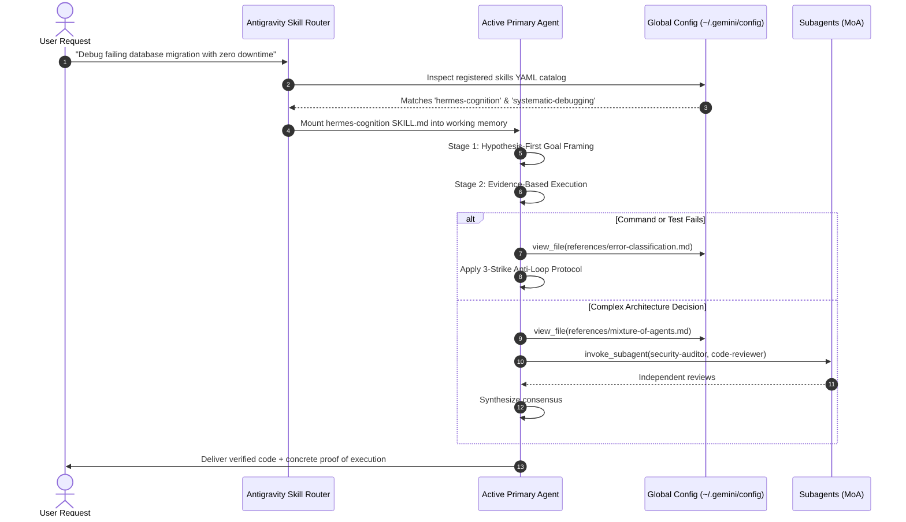

# Antigravity Global Skill System Architecture

The **Antigravity Global Skill System** enables autonomous AI agents to expand their cognitive capabilities, standard operating procedures (SOPs), and specialized tooling workflows dynamically across projects without bloating baseline context prompts.

---

## 1. Customization Hierarchy & Discovery

Antigravity uses a deterministic file system discovery mechanism to detect skills, rules, and configurations.

```
                      +---------------------------------------+
                      |       Built-in System Skills          |
                      | (Shipped with CLI / IDE runtime)      |
                      +---------------------------------------+
                                          |
                                          v
                      +---------------------------------------+
                      |       Global User Skills              |
                      |    ~/.gemini/config/skills/           |
                      |   (Available across all projects)     |
                      +---------------------------------------+
                                          |
                                          v
                      +---------------------------------------+
                      |      Workspace Project Skills         |
                      |          .agents/skills/              |
                      | (Committed in repo, team-shared)      |
                      +---------------------------------------+
```

### Precedence Rules

| Level | Path | Scope | Overrides |
| :--- | :--- | :--- | :--- |
| **Workspace Local** | `<repo_root>/.agents/skills/<name>/` | Single repository | Overrides Global & Built-in |
| **Global User** | `~/.gemini/config/skills/<name>/` | All projects on machine | Overrides Built-in |
| **Built-in** | Antigravity Runtime internals | Global baseline | Fallback default |

When a skill name collision occurs, the more local scope takes precedence.

---

## 2. Anatomy of a Skill Package

A skill is not simply a system prompt. It is an **executable knowledge package** designed around the principle of **Progressive Disclosure**:

```
skills/hermes-cognition/
├── SKILL.md                  # Main entry point & YAML frontmatter
└── references/               # Secondary deep-dive documentation (read on demand)
    ├── error-classification.md
    ├── memory-and-state.md
    └── mixture-of-agents.md
```

### A. The Entry Point: `SKILL.md`

`SKILL.md` contains two sections:
1. **YAML Frontmatter**: Parsed by Antigravity's skill indexer to determine eligibility and trigger conditions.
2. **Core Operational Directives**: High-density instructions that govern immediate execution once triggered.

```yaml
---
name: hermes-cognition
description: >-
  Hermes Agent-grade autonomous cognition, self-correction loops, memory retention, context compaction,
  and Mixture-of-Agents (MoA) synthesis for complex programming, debugging, and system orchestration.
  Activate when solving complex bugs, architecting deep systems, performing multi-agent reviews,
  or when the user requests rigorous, verified, and autonomous problem solving.
---
```

#### Why Description Quality Matters
The agent matches user queries, implicit problem domains, or explicit keywords against the `description` field. A well-crafted description outlines:
- **What** the skill accomplishes.
- **When** to invoke it (trigger conditions, symptoms, problem types).
- **Key vocabulary** that signals intent.

### B. Progressive Disclosure (`references/`)

If a skill contained 50,000 words in `SKILL.md`, it would consume substantial context window upon activation. Instead, Antigravity uses **Progressive Disclosure**:
- `SKILL.md` introduces core protocols (1,000–2,000 tokens).
- Specific protocols link to `references/<topic>.md`.
- The agent only reads `references/error-classification.md` when an actual failure occurs, preserving context for code and analysis.

---

## 3. Dynamic Skill Activation Lifecycle



---

## 4. Deploying Custom Global Skills

### Step 1: Create Directory
```powershell
New-Item -ItemType Directory -Path "$env:USERPROFILE\.gemini\config\skills\<your-skill-name>" -Force
```

### Step 2: Write `SKILL.md`
Ensure valid YAML frontmatter at the top (lines 1 to 8):
```markdown
---
name: your-skill-name
description: Clear, action-oriented trigger instructions.
---

# Your Skill Title
Detailed instructions...
```

### Step 3: Verify Discovery
Restart or start a new Antigravity session. The skill will automatically appear in the agent's available skill registry without requiring code recompilation or environment variable exports.
