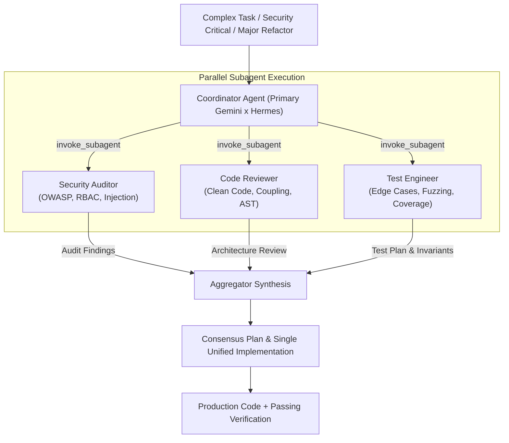

# Mixture-of-Agents (MoA) Orchestration Protocol

Single-agent systems often suffer from cognitive blind spots: an agent optimizing for raw runtime execution speed may introduce security regressions, while an agent focusing strictly on theoretical security may create brittle or unmaintainable APIs.

**Mixture-of-Agents (MoA)** in Antigravity coordinates specialized, concurrent subagents to audit, stress-test, and synthesize multi-dimensional solutions.

---

## 1. Orchestration Flow



---

## 2. Standard Subagent Archetypes

| Subagent Type | Native Subagent Name | Primary Mandate | Key Verification Checks |
| :--- | :--- | :--- | :--- |
| **Security Auditor** | `security-auditor` | Vulnerability assessment & threat modeling | Input sanitization, authentication/authorization checks, OWASP Top 10, secret leakage, CSRF/XSS/SSRF. |
| **Code Reviewer** | `code-reviewer` | Architectural integrity & maintainability | Interface boundaries, separation of concerns, SOLID principles, cyclomatic complexity. |
| **Test Engineer** | `test-engineer` | Quality assurance & failure resilience | Boundary condition tests, edge cases, deterministic mocking, regression test suites. |
| **Web Performance Auditor** | `web-performance-auditor` | Latency, throughput, and rendering | Core Web Vitals (LCP, CLS, INP), N+1 queries, memory leaks, asset bundle size. |

---

## 3. Invocation Mechanics in Antigravity

Subagents are invoked concurrently using the native `invoke_subagent` tool:

```json
{
  "Subagents": [
    {
      "TypeName": "security-auditor",
      "Role": "Security Reviewer",
      "Prompt": "Audit the newly implemented authentication token rotation in auth.py for race conditions, replay vulnerability, and timing attacks."
    },
    {
      "TypeName": "code-reviewer",
      "Role": "Architecture Reviewer",
      "Prompt": "Review auth.py for readability, adherence to PEP 8, and clean interface boundaries."
    }
  ]
}
```

### Key Behavioral Rules:
1. **Never Poll in a Loop**: Antigravity is reactive. Once subagents are dispatched, the coordinator stops calling tools and waits for the reactive wakeup message.
2. **Aggregator Role**: The coordinator agent does not simply regurgitate raw reports from each subagent. It:
   - Identifies points of full consensus.
   - Resolves points of tension (e.g. balancing security hardening vs developer ergonomics).
   - Writes the unified, hardened code.
