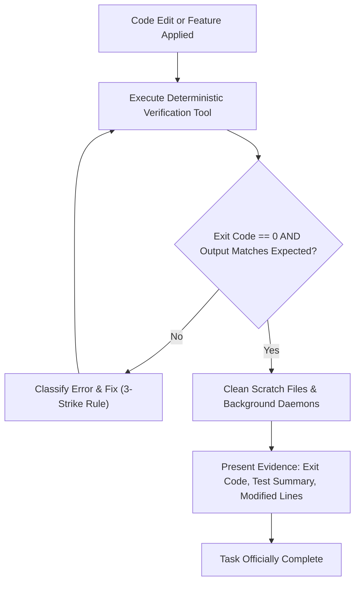

# The Zero-Hallucination Completion Contract

The fundamental tenet of the **Gemini x Hermes** framework is:
> **"Never guess when you can verify. Never claim completion without proof. Never repeat a failing path without changing the underlying state."**

---

## 1. The Zero-Hallucination Gate

An agent is strictly barred from concluding a task, closing an issue, or presenting a solution as finished unless it passes through the **Zero-Hallucination Gate**.

---

## 2. The 3 Mandatory Verification Pillars

### Pillar 1: Deterministic Verification
- Every code change must be validated by running an actual verification command:
  - Unit tests (`pytest`, `vitest`, `jest`, `go test`, `cargo test`).
  - Linter / typecheck (`mypy`, `tsc --noEmit`, `eslint`, `ruff`).
  - Targeted integration scripts.
- Compiling or running tests mentally in the agent's LLM context does **not** count as verification.

### Pillar 2: Visible Evidence
- The agent must output concrete proof to the user:
  - Exact command line executed.
  - Exit code (`0`).
  - Relevant lines of standard output confirming success (e.g., `5 passed, 0 failed in 0.42s`).

### Pillar 3: Clean Teardown
- Before declaring task completion:
  - Kill any background testing servers or lingering daemons.
  - Remove temporary debugging logs or scratch files (or isolate them under `scratch/`).
  - Leave the git repository in a clean, reproducible state.

---

## 3. Forbidden Completion Anti-Patterns

| Prohibited Statement | Why It Violates the Protocol | Mandatory Remedy |
| :--- | :--- | :--- |
| *"This should now work."* | Speculative assertion without verification. | Run the command or test and report the actual output. |
| *"I have fixed the syntax error."* | Claim made before compiling or running linter. | Run linter/typecheck and confirm zero errors. |
| *"All tests ought to pass."* | Probabilistic guess. | Execute the test suite and paste the passing result. |
