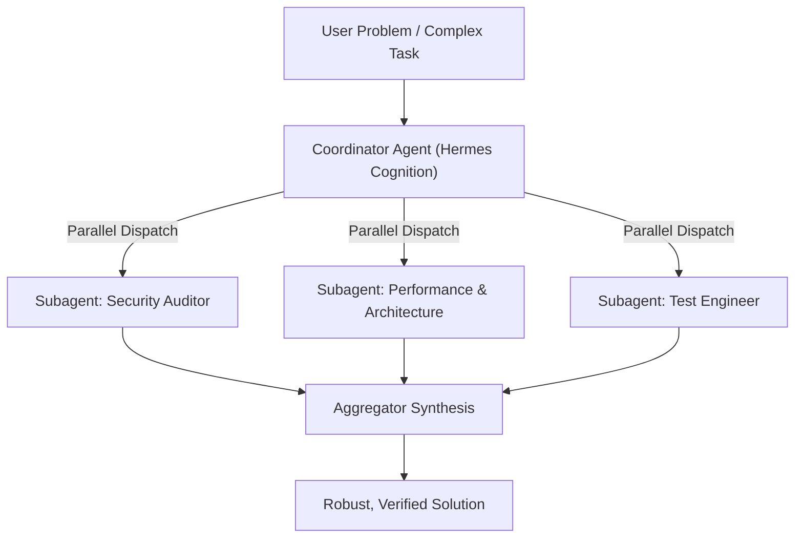

# Mixture-of-Agents (MoA) Orchestration Protocol

Adapted from Hermes Agent (`tools/mixture_of_agents_tool.py` & `tools/delegate_tool.py`).

When facing non-trivial architectural decisions, large refactors, or mission-critical code changes, single-pass generation can have blind spots. The Mixture-of-Agents (MoA) methodology leverages distinct specialized subagents to generate independent perspectives, which are then synthesized into an optimal final solution.

---

## 1. When to Trigger MoA

Trigger MoA subagent orchestration when:
1. **Multi-Domain Problem**: The task requires simultaneous optimization across security, performance, and API design.
2. **Ambiguous or Large Scope**: Multiple architectural paths exist and trade-offs need rigorous evaluation.
3. **Pre-Merge Audit**: High-stakes code changes requiring exhaustive verification.

---

## 2. Standard MoA Archetypes (Subagents)

Using Antigravity's native `invoke_subagent` tool:

1. **Security Auditor (`security-auditor`)**:
   - Focus: Input validation, privilege escalation, secret leakage, OWASP vulnerabilities, injection surfaces.
2. **Architecture & Performance (`code-reviewer` / `web-performance-auditor`)**:
   - Focus: Maintainability, separation of concerns, algorithmic complexity, memory management, latency.
3. **Test Engineer (`test-engineer`)**:
   - Focus: Edge cases, boundary condition testing, mocking strategy, reproduction scripts.

---

## 3. Aggregation & Synthesis Rules

The coordinator agent acts as the Aggregator:
1. **Identify Consensus**: Where all agents agree, adopt the recommendation immediately.
2. **Resolve Conflicts**: Where agents disagree (e.g. security strictness vs developer ergonomics), evaluate according to project constraints and state trade-offs explicitly.
3. **Consolidate into Concrete Code**: Deliver one single unified, polished implementation rather than disjointed snippets.
